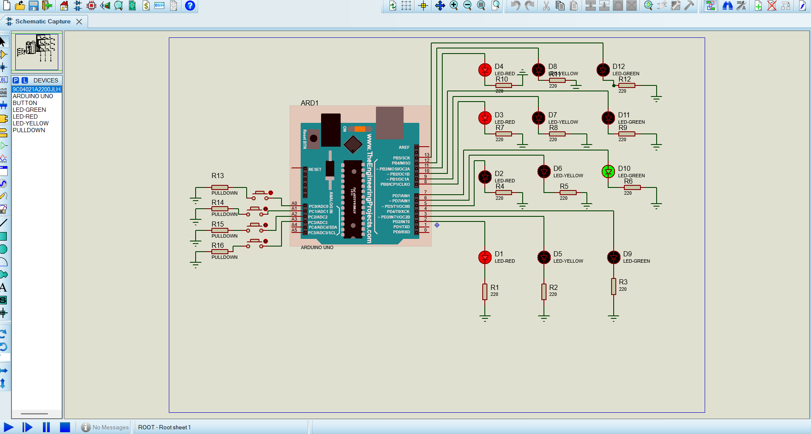

# Traffic-Signal-Optimization-System-using-Embedded-Systems
Traffic Signal Optimization System is an Arduino-based embedded system that automates traffic control using LEDs and timers. It manages vehicle movement by controlling red, yellow, and green signals in a predefined sequence, reducing traffic congestion, improving road safety, and ensuring efficient traffic flow.
# 🚦 Traffic Signal Optimization System using Embedded Systems

## 📌 Project Description
The Traffic Signal Optimization System using Embedded Systems is an Arduino-based solution that automates traffic control using LEDs and timers. It manages vehicle movement by controlling red, yellow, and green signals in a predefined sequence, reducing traffic congestion, improving road safety, and ensuring efficient traffic flow.

---

## 🎯 Objectives
- Automate traffic signal operation  
- Reduce manual traffic control  
- Improve traffic management efficiency  
- Ensure safe vehicle movement  

---

## ⚙️ Features
- Automatic traffic signal switching  
- Red, Yellow, and Green LED control  
- Timer-based traffic management  
- Efficient and low-cost design  
- Easy hardware implementation  

---

## 🛠️ Technologies Used
- Arduino UNO  
- LEDs  
- Resistors  
- Embedded C  
- Proteus Simulation  

---

## 📂 Project Files
- `trafficsignalsystem.ino` → Arduino code  
- `trafficsignal.pdsprj` → Proteus simulation  
- `simulation.png` → Circuit image  
- `index.html` → Web interface  
- `style.css` → Website styling  

---

## 📷 Project Output

---

## 🌐 Website Files
- `index.html` → Web interface  
- `style.css` → Styling of webpage  
- `script.js` → Website functionality    

---

## 🌍 Live Website
https://shreya-0604.github.io/Traffic-Signal-Optimization-System-using-Embedded-Systems/

---

## 🚀 Future Scope

---

## 🚀 Future Scope
- AI-based traffic signal optimization  
- Emergency vehicle priority system  
- IoT-based traffic monitoring  
- Smart city integration  

---

## 👩‍💻 Author
Shreya Patil
